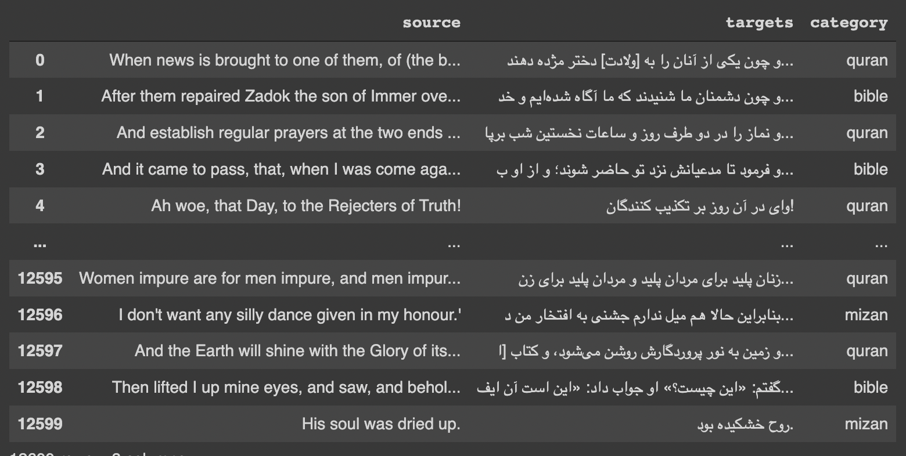

# Persian and English Text classification using Multilingual Bert

In this task, a set of Persian and English data set is classified using a multilingual BERT.

An example of an training dataset is as follows, which can be downloaded from Dataset folder.

